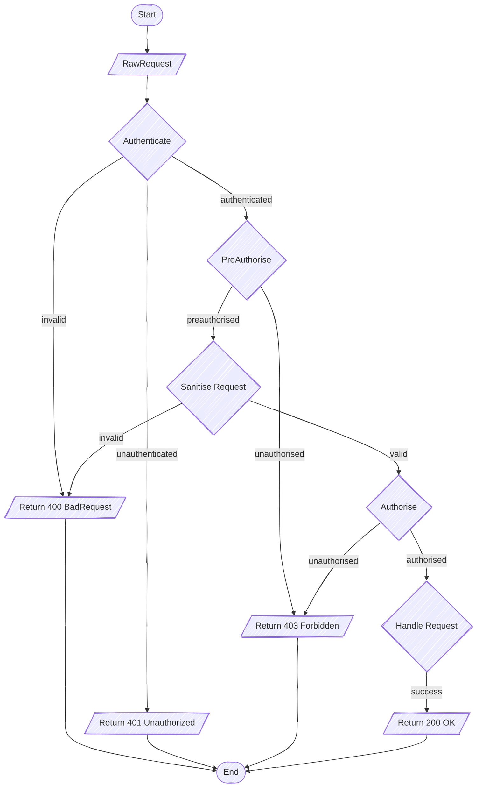

# Songbird

An opinionated library for building REST APIs with strictly enforced validation for all inputs and outputs, and native
support for generating API documentation in [OpenAPI 3.1](https://swagger.io/specification/) format, using [zod-to-openapi](https://github.com/asteasolutions/zod-to-openapi). All path parameters, query parameters, cookies and other headers are parsed into JSON objects and are validated against the [Zod](https://zod.dev/) Schemas provided.

Songbird itself does not include an HTTP server or router – it is a service builder, meant to be mounted to a web framework such as Express or Koa via an adapter. An [Adapter for Express](./src/libs/adapter/ExpressAdapter.ts) is already bundled in with the library.

---

## Getting Started

> **NOTE:** This library is still in development, and has not yet been published to npm.

To get an idea of how to use Songbird, please see the [examples](./examples) directory.

---

## Songbird Request Flow

Routing is delegated to the web app framework Songbird is integrated with via the adapter. Once routing is complete, the request is parsed into a `RawRequest` object, which is then passed to the `RestEndpoint` instance that corresponds to the requested route.
Below is a diagram of the various stages the request goes through inside Songbird – each of these can be customised when constructing the `RestEndpoint` instance.

Please note that request processing may abort at any stage if an exception occurs, returning a `500 Internal Server Error` response.

### Authenticate

This stage is responsible for authenticating the request via a subclass of the `Authenticator` class. It can have access to path parameters, query parameters, headers and cookies to determine whether the request is authenticated – **please note** that it performs validation on all those inputs via the Zod Schemas provided; therefore, the request flow may abort with a validation failure here. Also worth noting that the validation schemas defined for the Authenticator are only used for validating the Authenticator inputs and are not being used in the later Sanitise Request stage, which has its own, separate schemas.

Authenticators may return a payload which contains additional information on the authenticated client, for example, a client ID or access roles. This information is then available to downstream stages when making decisions.

### PreAuthorise

This is an optional stage to perform more lightweight authorisation before we do the work of validating the entire request. The only information available to it is the payload returned from the Authenticator stage.

A common use case would be to restrict all `/admin/*` paths to users who were granted the `admin` role.

### Sanitise Request

This stage is responsible for parsing and validating the request body, query parameters and headers, using the Zod Schemas provided.

### Authorise

This stage is responsible for performing a more complete authorisation check, since it has the fully validated request available to it.

### Handle Request

This stage contains the actual business logic of the endpoint. It is expected to return an `OkResponse` on completion; for any error cases, it should throw an exception. The idea is that by this point we should have performed all the necessary authorisation and validation checks in upstream stages, so we should only encounter unexpected errors here.
